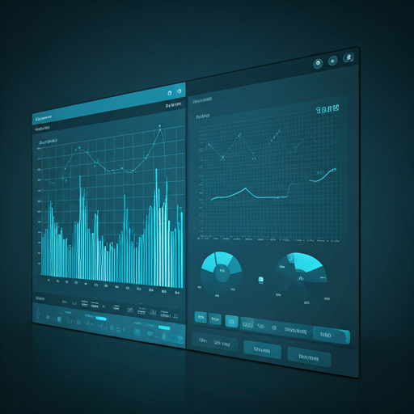

::: {.fims-giant-card}
::: {.fims-hero-content}
<span class="fims-badge">FIMS Open Science Ecosystem</span>

<h1 class="fims-title">Collaborating for Sustainable Fisheries</h1>

<p class="fims-desc">
Join a global network of scientists, developers, and researchers building the future of fisheries integrated modeling. Open source, collaborative, and peer-reviewed.
</p>

<div class="fims-actions">
<button onclick="window.location.href='#getting-involved'" class="btn btn-danger fims-btn fims-btn-shadow">
  <i class="bi bi-megaphone-fill"></i> Get Involved Now
</button>
<button onclick="window.location.href='../about/calendar.html'"class="btn btn-outline-light fims-btn">
  <i class="bi bi-calendar-month"></i> Join Next Meeting
</button>
</div>
:::
:::

::: {.fims-pulse-section}

::: {.fims-pulse-header}
::: {.fims-pulse-titles}
## Ecosystem Pulse
Live activity across the FIMS development pipeline.
:::

<a href="https://github.com/orgs/NOAA-FIMS/projects/29" class="fims-pulse-link">View Full Dashboard <i class="bi bi-arrow-right"></i></a>
:::

::: {.fims-pulse-layout}

::: {.fims-pulse-main-col}
::: {.fims-feed-card}
::: {.fims-feed-header}
::: {.fims-feed-title-group}
::: {.fims-feed-icon}
<i class="bi bi-terminal-fill"></i>
:::
### Recent GitHub Activity
:::
::: {.fims-feed-badge}
fims / main
:::
:::

::: {#github-activity-feed .fims-feed-list}
::: {.fims-feed-loading}
Loading recent activity...
:::
:::
:::
:::

```{r}
#| echo: false
#| results: asis
#| message: false
#| warning: false

if(!requireNamespace("glue", quietly = TRUE)) {
  install.packages("glue", repos = "https://cloud.r-project.org")
}
library(glue)

cal_id <- "c_6eluv1h8o830k7vt8ctcs6ghto@group.calendar.google.com"

# Calculates today's date formatted as a URL-safe text timestamp
start_bound <- URLencode(format(Sys.time(), "%Y-%m-%dT00:00:00Z", tz="UTC"))

# Forces Google to dump the historical backlog and show up to 100 current/future events
url <- paste0(
  "https://calendar.google.com/calendar/ical/", URLencode(cal_id), "/public/basic.ics",
  "?timeMin=", start_bound,
  "&maxResults=100",
  "&singleEvents=true"
)

tryCatch({
  tmp_ics <- tempfile(fileext = ".ics")
  
  if (Sys.info()[["sysname"]] == "Windows") {
    download.file(url, destfile = tmp_ics, method = "wininet", quiet = TRUE)
  } else {
    options(download.file.method = "curl", download.file.extra = "-L -k")
    download.file(url, destfile = tmp_ics, quiet = TRUE)
  }
  
  raw_lines <- readLines(tmp_ics, warn = FALSE)
  
  # Crucial for iCal: Join lines that Google wraps/folds at 75 characters
  unfolded_text <- paste(raw_lines, collapse = "\n")
  unfolded_text <- gsub("\n[ \t]", "", unfolded_text) 
  lines <- strsplit(unfolded_text, "\n")[[1]]
  
  event_starts <- which(lines == "BEGIN:VEVENT")
  event_ends   <- which(lines == "END:VEVENT")
  events_list <- list()
  
  if (length(event_starts) > 0) {
    for (i in seq_along(event_starts)) {
      ev_lines <- lines[event_starts[i]:event_ends[i]]
      summary_line <- ev_lines[grep("^SUMMARY:", ev_lines)]
      dtstart_line <- ev_lines[grep("^DTSTART([;:])", ev_lines)]
      desc_line    <- ev_lines[grep("^DESCRIPTION:", ev_lines)]
      
      if (length(summary_line) > 0 && length(dtstart_line) > 0) {
        summary_text <- sub("^SUMMARY:", "", summary_line[1])
        raw_time <- sub("^DTSTART.*:", "", dtstart_line[1])
        
        # --- Clean up the description ---
        desc_text <- ""
        if (length(desc_line) > 0) {
            desc_text <- sub("^DESCRIPTION:", "", desc_line[1])
            
            # 1. Chop off Google's weird visual divider and everything after it
            desc_text <- sub("-::~:~::~:~:~.*", "", desc_text)
            
            # 2. Convert iCal newlines to HTML breaks
            desc_text <- gsub("\\\\n|\\\\N", "<br>", desc_text)
            
            # 3. Chop off standard meeting link text (just in case the divider was missing)
            desc_text <- sub("<br>This event has a video call.*", "", desc_text)
            desc_text <- sub("<br>Join with Google Meet.*", "", desc_text)
            desc_text <- sub("<br>Join Zoom Meeting.*", "", desc_text)
            
            # 4. Clean up any lingering trailing breaks from
```

:::
:::

::: {.fims-contribute-header}
## Ways to Contribute
Whether you're a seasoned modeler or a first-time open-source contributor, there's a place for you in the FIMS community.
:::

::: {.fims-card-grid}
::: {.fims-card}
::: {.fims-card-icon}
<i class="bi bi-terminal-fill"></i>
:::
### Code & Logic
Help implement new population dynamics features or optimize existing C++ and R libraries.

* <i class="bi bi-check-circle-fill fims-text-success"></i> Good first issues
* <i class="bi bi-check-circle-fill fims-text-success"></i> Bug triaging
:::

::: {.fims-card}
::: {.fims-card-icon}
<i class="bi bi-file-earmark-text-fill"></i>
:::
### Documentation
Clarify scientific methods, write tutorials, or improve our API documentation and guides.

* <i class="bi bi-check-circle-fill fims-text-success"></i> Wiki updates
* <i class="bi bi-check-circle-fill fims-text-success"></i> Use-case studies
:::

::: {.fims-card}
::: {.fims-card-icon}
<i class="bi bi-diagram-3-fill"></i>
:::
### Scientific Peer Review
Participate in working groups to validate the mathematical integrity of new modeling modules.

* <i class="bi bi-check-circle-fill fims-text-success"></i> Technical review
* <i class="bi bi-check-circle-fill fims-text-success"></i> Algorithm testing
:::
:::

::: {.fims-steps-section}
::: {.fims-steps-intro}
## Getting Involved
Follow these 4 simple steps to start contributing to the FIMS project today.

{.fims-steps-img}
:::

::: {.fims-steps-list}
::: {.fims-step}
::: {.fims-step-number}
1
:::
::: {.fims-step-content}
#### Introduce Yourself
Introduce yourself on the FIMS discussion board and start following discussions and the FIMS repository.

<a href="https://github.com/orgs/NOAA-FIMS/discussions/801" class="fims-step-link">Introduce Yourself <i class="bi bi-box-arrow-up-right"></i></a>
:::
:::

::: {.fims-step}
::: {.fims-step-number}
2
:::
::: {.fims-step-content}
#### Go through the FIMS Vignettes
Go through the FIMS vignettes to understand the package's functionality.

<a href="https://noaa-fims.github.io/FIMS/" class="fims-step-link">Learn Now <i class="bi bi-file-text"></i></a>
:::
:::

::: {.fims-step}
::: {.fims-step-number}
3
:::
::: {.fims-step-content}
#### Review Contribution Guide
Read our technical standards for contributing to FIMS.

<a href="https://github.com/NOAA-FIMS/FIMS/blob/main/CONTRIBUTING.md" class="fims-step-link">Read Guide <i class="bi bi-file-text"></i></a>
:::
:::

::: {.fims-step}
::: {.fims-step-number}
4
:::
::: {.fims-step-content}
#### Come to Code Club and other FIMS trainings
Attend FIMS Code Clubs and trainings to learn more about contributing to FIMS and connect with other contributors. You don't need to be an expert to attend - these are meant to be welcoming spaces for learning and collaboration!

<a href="../about/calendar.html'" class="fims-step-link">Browse Calendar <i class="bi bi-people"></i></a>
:::
:::

::: {.fims-step}
::: {.fims-step-number}
5
:::
::: {.fims-step-content}
#### Start Small
Pick a 'Good First Issue' on GitHub and submit your first pull request for peer review.

<a href="https://github.com/NOAA-FIMS/FIMS/issues?q=is%3Aissue%20state%3Aopen%20label%3A%22good%20first%20issue%22" class="btn btn-dark fims-btn-small">Find First Issue</a>
:::
:::
:::
:::

::: {.mb-5}
<h2 class="fw-bold text-primary mb-4">Community Highlights</h2>

::: {.row .g-3}
::: {.col-6 .col-md-3}
::: {.ratio .ratio-1x1 .rounded-3 .overflow-hidden .position-relative .bg-dark}

<div class="position-absolute bottom-0 start-0 w-100 p-3 bg-gradient-dark">
<span class="text-white fw-bold small text-uppercase d-block">Workshop 2024</span>
<span class="text-white-50 small">Seattle, WA</span>
</div>
:::
:::

::: {.col-6 .col-md-3}
::: {.ratio .ratio-1x1 .rounded-3 .overflow-hidden .position-relative .bg-dark}

<div class="position-absolute bottom-0 start-0 w-100 p-3 bg-gradient-dark">
<span class="text-white fw-bold small text-uppercase d-block">Peer Review session</span>
<span class="text-white-50 small">Virtual Session</span>
</div>
:::
:::

::: {.col-6 .col-md-3}
::: {.ratio .ratio-1x1 .rounded-3 .overflow-hidden .position-relative .bg-dark}

<div class="position-absolute bottom-0 start-0 w-100 p-3 bg-gradient-dark">
<span class="text-white fw-bold small text-uppercase d-block">New Contributor Day</span>
<span class="text-white-50 small">Online Event</span>
</div>
:::
:::

::: {.col-6 .col-md-3}
::: {.ratio .ratio-1x1 .rounded-3 .overflow-hidden .position-relative .bg-dark}

<div class="position-absolute bottom-0 start-0 w-100 p-3 bg-gradient-dark">
<span class="text-white fw-bold small text-uppercase d-block">Governance Meeting</span>
<span class="text-white-50 small">Washington, DC</span>
</div>
:::
:::
:::
:::

<style>
/* A few micro-interactions converted from Tailwind utilities */
.hover-lift { transition: transform 0.2s ease, box-shadow 0.2s ease; }
.hover-lift:hover { transform: translateY(-4px); box-shadow: 0 .5rem 1rem rgba(0,0,0,.15)!important; }
.bg-gradient-dark { background: linear-gradient(to top, rgba(0,0,0,0.8), transparent); }
</style>