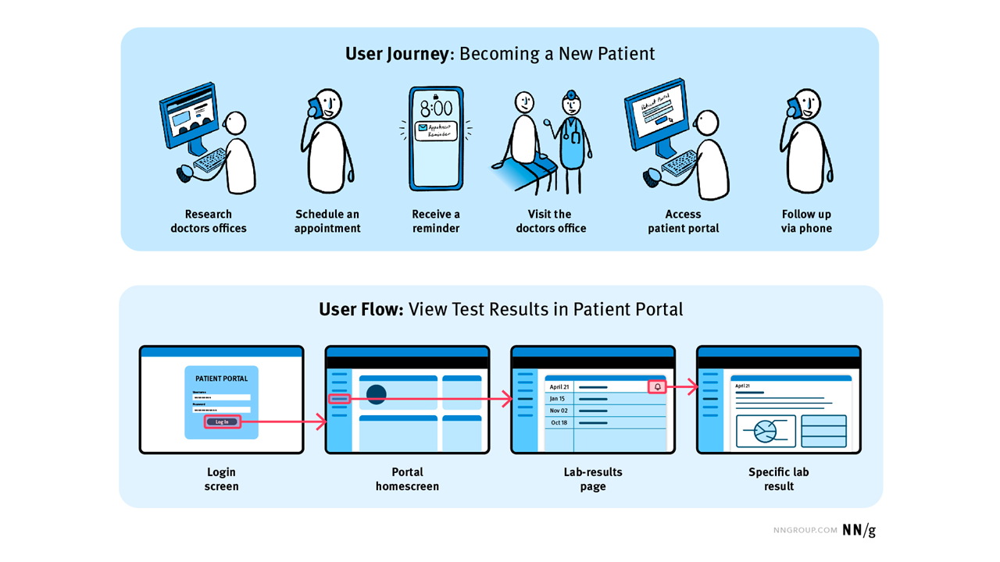

```{=html}
<div class="site-hero mb-5">
  <div class="site-intro">
    <h1 class="site-title text-primary mt-0 fw-lighter text-center text-sm-start">
      NOAA Fisheries Integrated Modeling System
    </h1>

    <div class="social-icon-links my-3" aria-hidden="true">
      <a
        class="link-primary"
        href="https://github.com/NOAA-FIMS"
        title="FIMS on GitHub"
        aria-label="Visit FIMS on GitHub"
        target="_blank"
        rel="noopener"
      >
        <i class="fab fa-github fa-lg fa-fw"></i>
      </a>

      <a
        class="link-primary"
        href="https://noaa-fims.r-universe.dev"
        title="FIMS R Universe"
        aria-label="Visit FIMS R Universe repository"
        target="_blank"
        rel="noopener"
      >
        <i class="fab fa-r-project fa-lg fa-fw"></i>
      </a>

      <a
        class="link-primary"
        href="https://nmfs-ost.github.io/noaa-fit/"
        title="NOAA Fisheries Integrated Toolbox"
        aria-label="Visit NOAA Fisheries Integrated Toolbox"
        target="_blank"
        rel="noopener"
      >
        <i class="fa fa-briefcase fa-lg fa-fw"></i>
      </a>
    </div>

    <p class="site-intro fs-5">
      Welcome to the <strong>Fisheries Integrated Modeling System (FIMS)</strong> community playbook, your source of information for all members of the FIMS community--developers, users, and receivers of stock assessments. We welcome both those that are new and seasoned to the field to join us as we work to fulfill our <a href="about/index.qmd#mission">mission</a>! <br>
      <br>
      We use the following icons to help each type of community member find relevant information quickly within this playbook:<br>

      <i class="fa-solid fa-laptop-code"></i> <strong>Developer</strong><br>
      An active developer of FIMS that is wanting information on how to change the codebase or update the documentation. <br>
      <i class="fa-solid fa-user-plus"></i> <strong>New User</strong><br>
      Someone who wants to use FIMS but is uncertain how to start or is more comfortable using the wrapper functions in R rather than specifying the model line by line with lists. <br>
      <i class="fa-solid fa-bolt"></i> <strong>Power User</strong><br>
      A repeat user of FIMS who wants to dig into the source code to see how it is connected to R or someone who wants more control of their model than what the wrapper functions in R provide. <br>
      <i class="fa-solid fa-chart-line"></i> <strong>Receiver of Results</strong><br>
      Typically a manager or stakeholder who has a desire to explore the model output without wanting to use FIMS themselves. <br>
    </p>
    <a class="mt4 action text" href="about/index.qmd">See the <strong>overview page</strong> for more! →</a>
  </div>

  <div class="site-logo">
    
  </div>
</div>
```

## about

::: {#fims-about-listing}
:::

## FIMS User Pathways Option 1

```{=html}
<div class="fims-graphic-container">
  

  <div class="hotspot" id="hs-user1" onclick="changeImage('images/fims-user1.png')"></div>
  <div class="hotspot" id="hs-user2" onclick="changeImage('images/fims-user2.png')"></div>
</div>
```
